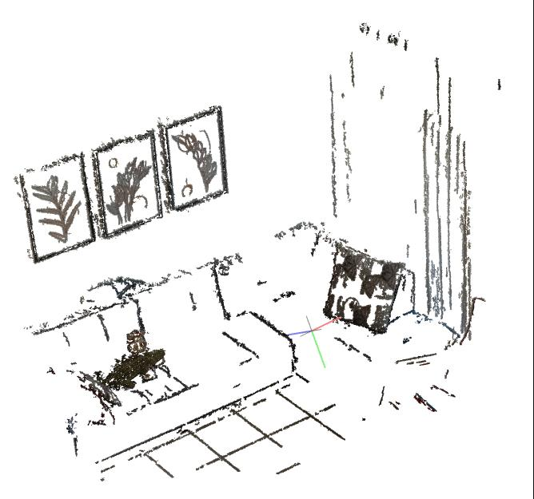
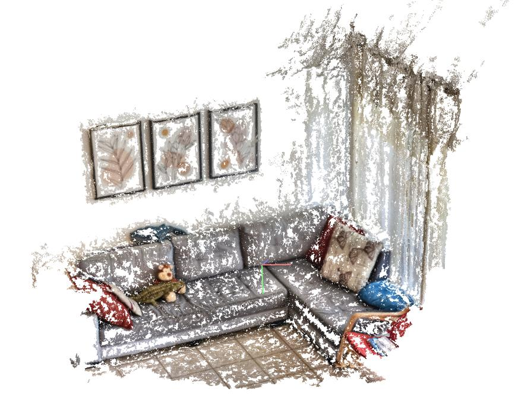
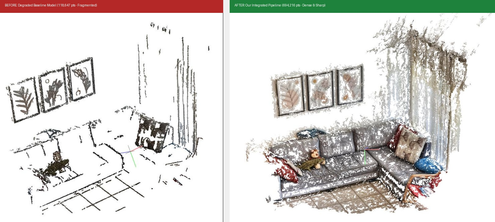
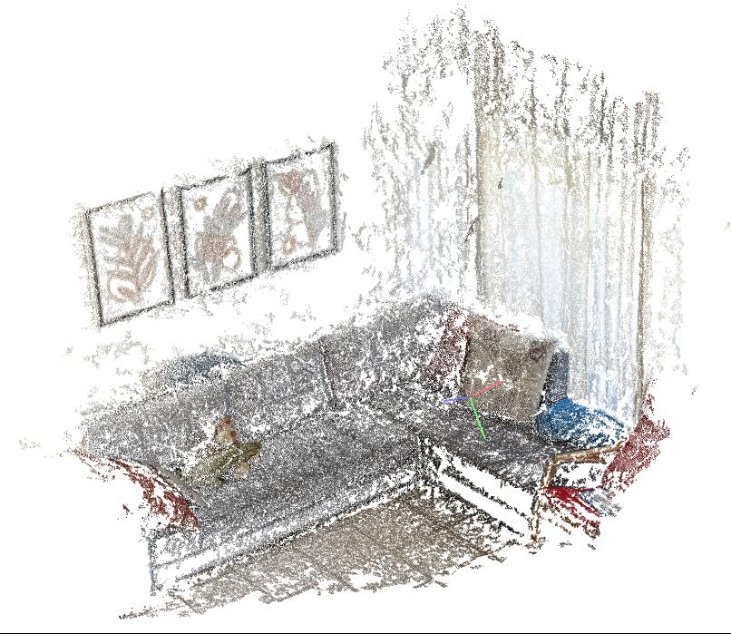
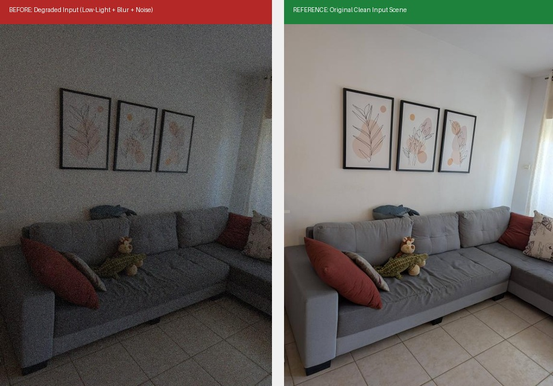
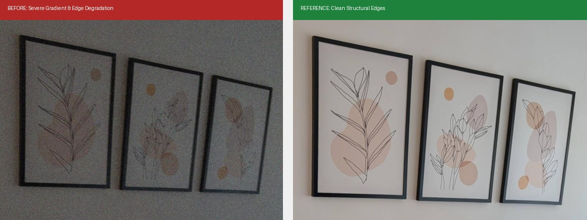
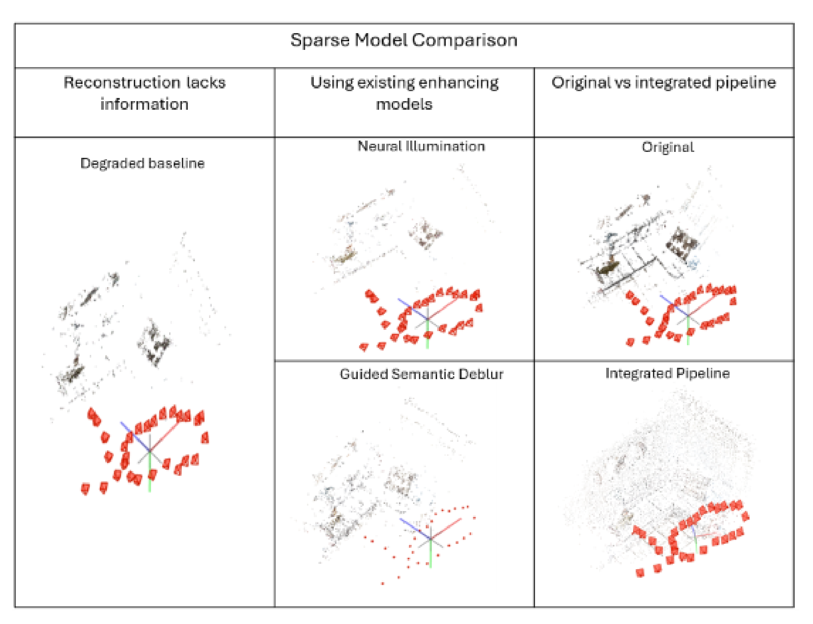
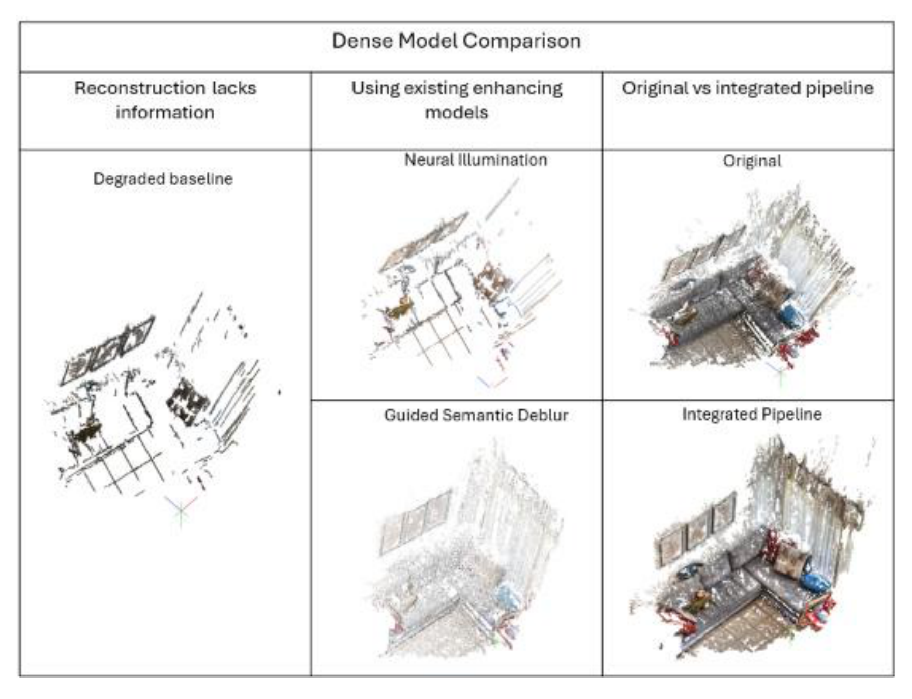
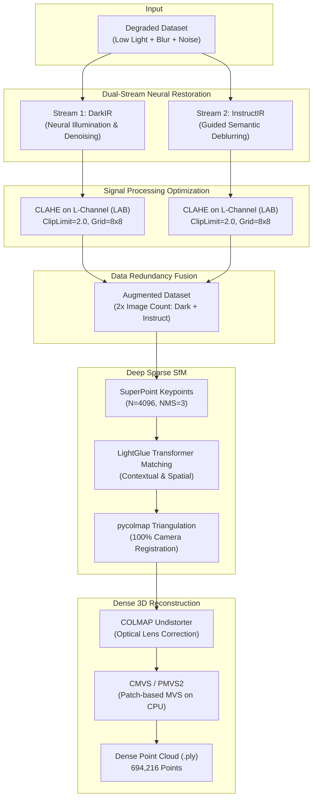

# Intelligent Image Enhancement System for Low-Light Conditions and its Evaluation as a Tool for Enhancing 3D-Reconstruction

[](https://colab.research.google.com/github/yehezkelab-lab/3D-image-reconstruction/blob/main/notebooks/3D_Reconstruction_Pipeline.ipynb)
[](https://python.org)
[](https://pytorch.org)
[](https://colmap.github.io/)
[](https://opensource.org/licenses/MIT)

> **B.Sc. Final Research Project**  
> **Department of Electrical and Electronics Engineering**  
> **Sami Shamoon College of Engineering (SCE), Beer-Sheva**  
> **Author:** Yehezkel Abaev ([yehezkelab-lab](https://github.com/yehezkelab-lab))  
> **Supervisor:** Dr. Amit Efraim  
> **Date:** July 2026  

---

## 📌 Abstract

Real-world visual data captured under adverse field conditions—characterized by **severe underexposure**, **sensor thermal noise**, and **motion blur**—frequently leads classical Structure-from-Motion (SfM) and Multi-View Stereo (MVS) algorithms to fail. Traditional keypoint detectors (such as SIFT and ORB) rely heavily on local intensity gradients, which collapse in low light, produce spurious features under noise, and smear under camera motion. Single-model deep learning restorations often cause **over-smoothing**, destroying micro-textures required for photometric consistency.

This project introduces a **data-redundancy dual-stream restoration and deep feature matching pipeline**:
1. **Parallel Neural Restoration:** The degraded dataset is split into two complementary deep learning streams:
   - **DarkIR** (Neural Illumination): Recovers hidden geometry in deep shadows and suppresses camera sensor noise.
   - **InstructIR** (Guided Semantic Deblur): Uses natural language prompts (*"Please remove the blur and restore the image to be sharp."*) to restore edge sharpness and structural contours.
2. **DSP Contrast Optimization:** Local Contrast-Limited Adaptive Histogram Equalization (**CLAHE**) in CIELAB color space widens dynamic range without boosting background noise.
3. **Data Redundancy Fusion:** Combining both restoration streams doubles dataset size (e.g., $28 \rightarrow 56$ images), providing visual redundancy from multiple computational angles.
4. **Deep Local Feature Matching:** Replaces classical SIFT with **SuperPoint** interest points and **LightGlue** transformer-based contextual matching.
5. **Dense 3D Reconstruction:** Lens distortion correction via COLMAP undistorter followed by **CMVS-PMVS2** patch-based multi-view stereo running efficiently on CPU.

While classical SfM completely fails to register cameras on the degraded dataset, our integrated pipeline achieves **100% camera registration** and reconstructs **694,216 dense 3D points**—surpassing even the clean baseline model.

---

## 🖼️ Visual Results: Before & After

### 1. 3D Dense Point Cloud Reconstruction: Before vs. After
The central finding of this research: when reconstructing from severely degraded conditions, standard pipelines collapse into sparse, disconnected fragments. Our integrated dual-stream pipeline recovers a complete, highly dense point cloud.

| Before: Degraded Baseline Model | After: Our Integrated Pipeline |
| :---: | :---: |
|  |  |
| **118,647 points** — Fragmented sofa, missing wall geometry, severe voids | **694,216 points** — Continuous, dense surface, sharp corners & preserved textures |

<p align="center">
  
</p>

### 3D Model Close-Up Comparison (Original vs. Degraded vs. Ours):
| (A) Original Clean Reference | (B) Degraded Baseline | (C) Integrated Pipeline (Ours) |
| :---: | :---: | :---: |
|  |  |  |
| **177,134 Points**<br>Baseline model from clean photos | **118,647 Points**<br>Severe data loss & camera registration failures | **694,216 Points**<br>Dense, faithful recovery overcoming optical degradation |

---

### 2. Optical Input Degradation: Before vs. Reference
Comparison between the physically corrupted input data (extreme low light $\alpha=0.45$, motion blur kernel 15px, thermal Gaussian noise $\sigma=20$) and the ground-truth scene.

<p align="center">
  
</p>

#### Close-up on High-Frequency Structural Features (Picture Frames):
Low contrast and noise confuse classical gradient detectors (SIFT/ORB), generating thousands of spurious noise features instead of true geometry.

<p align="center">
  
</p>

---

### 3. Comprehensive Model Benchmark Comparison

#### Sparse SfM Reconstruction Comparison
Comparison of camera registration and sparse point triangulation across all benchmarked methods:
- **Degraded Baseline:** Fails camera graph connectivity due to outlier matches.
- **Single DL Models (DarkIR / InstructIR):** Partial camera recovery, but noisy or sparse.
- **Our Integrated Pipeline:** 100% camera recovery with robust spatial convergence.

<p align="center">
  
</p>

#### Dense Multi-View Stereo (PMVS2) Comparison
Dense patch expansion across methods. Notice the severe holes in single-model approaches (due to over-smoothing) versus the continuous dense mesh in our integrated pipeline:

<p align="center">
  
</p>

---

## 📊 Quantitative Benchmark Results

Evaluated on the 28-image interior living room dataset:

| Dataset / Configuration | Input Images | Registered Cameras | Dense Points (PMVS2) | Reconstruction Quality |
| :--- | :---: | :---: | :---: | :--- |
| **Original (Clean Baseline)** | 28 | 28 / 28 | **177,134** | Benchmark ground truth |
| **Degraded Baseline** (Blur + Low-Light + Noise) | 28 | Failed / Partial | **118,647** | Incomplete, fragmented point cloud |
| **Neural Illumination Only (DarkIR)** | 28 | 28 / 28 | **122,223** | Noise removed, but linear edges blurred |
| **Semantic Deblur Only (InstructIR)** | 28 | Partial | **32,927** | Severe holes due to over-smoothing |
| **Integrated Dual Pipeline (Ours)** | **56** | **56 / 56 (100%)** | **694,216** | **Continuous, dense, sharp geometry & fine textures** |

### Key Qualitative Observations:
- **Sharp Edges (Picture Frames):** Retains rectangular geometry and sharp framing without edge dissolution.
- **Delicate Textures (Fabric Sofa):** Eliminates the artificial "plastic smoothing" artifact common in DL filters, preserving fabric roughness essential for photometric matching.
- **Flat Regions (White Walls):** Deep feature learning prevents spurious feature generation from sensor noise, keeping wall surfaces clean and free of floating outlier points.

---

## 🏗️ Architecture & Pipeline Flowchart



---

## 📁 Repository Structure

```
3D-image-reconstruction/
├── configs/                            # Configuration files for DL models
│   ├── darkir_npe.yml                  # DarkIR architecture options
│   └── instructir_eval5d.yml           # InstructIR dual model options
├── data/
│   └── sample_images/                  # Sample test images from dataset
├── docs/
│   └── images/                         # Figures and Before/After comparisons from thesis
├── notebooks/
│   └── 3D_Reconstruction_Pipeline.ipynb # Complete 5-step Google Colab Notebook
├── scripts/
│   ├── simulate_degradation.py         # Simulates blur, underexposure, and noise
│   ├── run_dual_enhancement.py         # CLI for DarkIR + InstructIR + CLAHE
│   ├── run_sparse_sfm.py               # CLI for SuperPoint + LightGlue + pycolmap
│   └── run_dense_pmvs.py               # CLI for COLMAP undistort + PMVS2
├── src/
│   ├── degradation/
│   │   └── degrader.py                 # Motion blur, attenuation, Gaussian noise
│   ├── enhancement/
│   │   ├── tiling.py                   # Tiled inference with seamless blending (OOM prevention)
│   │   ├── darkir_runner.py            # DarkIR model inference wrapper
│   │   ├── instructir_runner.py        # InstructIR language-guided inference
│   │   ├── clahe_runner.py             # LAB-space CLAHE contrast enhancement
│   │   └── dual_pipeline.py            # Dual-stream orchestrator (2x augmentation)
│   ├── reconstruction/
│   │   ├── sparse_reconstruction.py    # SuperPoint + LightGlue SfM via HLoc
│   │   └── dense_reconstruction.py     # Undistorter + CMVS-PMVS2 runner
│   └── utils/
│       └── dataset_utils.py            # Filename sanitization & archive helpers
├── run_pipeline.py                     # Root CLI runner for end-to-end execution
├── requirements.txt                    # Python dependencies
├── environment.yml                     # Conda environment definition
├── LICENSE                             # MIT License
└── README.md                           # Documentation
```

---

## 🚀 Quick Start

### 1. Google Colab (Recommended)

Run the full pipeline on a free GPU directly in Google Colab:

[](https://colab.research.google.com/github/yehezkelab-lab/3D-image-reconstruction/blob/main/notebooks/3D_Reconstruction_Pipeline.ipynb)

The notebook provides:
- Automated dependency installation
- Dual-stream neural restoration with 400x400 tiling
- CLAHE contrast adjustment
- Deep feature extraction with SuperPoint & LightGlue
- COLMAP undistortion and CMVS-PMVS2 dense reconstruction

### 2. Local Installation

```bash
# Clone the repository
git clone https://github.com/yehezkelab-lab/3D-image-reconstruction.git
cd 3D-image-reconstruction

# Create Conda environment
conda env create -f environment.yml
conda activate 3d_recon

# Or install via pip
pip install -r requirements.txt
pip install git+https://github.com/cvg/LightGlue.git
pip install git+https://github.com/cvg/Hierarchical-Localization.git
```

### 3. Clone Model Repositories & Weights

```bash
# DarkIR
git clone https://github.com/cidautai/DarkIR.git DarkIR
# InstructIR
git clone https://github.com/mv-lab/InstructIR.git InstructIR
# CMVS-PMVS (for dense reconstruction)
git clone https://github.com/pmoulon/CMVS-PMVS.git CMVS-PMVS
```

Pretrained weights required:
- `DarkIR_allLOL.pt` $\rightarrow$ place in `DarkIR/models/`
- `im_instructir-7d.pt` $\rightarrow$ place in `InstructIR/models/`
- `lm_instructir-7d.pt` $\rightarrow$ place in `InstructIR/models/`

---

## 🛠️ Step-by-Step Usage

### Step 0: Synthetic Degradation Simulation (Optional)
Simulate adverse conditions on clean images:
```bash
python scripts/simulate_degradation.py \
    --input_dir data/sample_images \
    --output_dir output/degraded \
    --blur_kernel 15 \
    --blur_angle 45.0 \
    --alpha 0.45 \
    --noise_sigma 20.0
```

### Step 1 & 2: Dual Neural Enhancement (DarkIR + InstructIR + Tiling)
```bash
python scripts/run_dual_enhancement.py \
    --input_dir output/degraded \
    --output_dir output/enhanced_dual \
    --darkir_weights DarkIR/models/DarkIR_allLOL.pt \
    --instructir_im_weights InstructIR/models/im_instructir-7d.pt \
    --instructir_lm_weights InstructIR/models/lm_instructir-7d.pt \
    --prompt "Please remove the blur and restore the image to be sharp."
```

### Step 3: Local Contrast Optimization (CLAHE)
Integrated by default in `DualEnhancementPipeline`. Can also be executed independently:
```bash
python run_pipeline.py --mode clahe \
    --raw_images output/enhanced_dual \
    --enhanced_dir output/fixed_images
```

### Step 4: Sparse Reconstruction (SuperPoint + LightGlue)
```bash
python scripts/run_sparse_sfm.py \
    --image_dir output/fixed_images \
    --output_dir output/hloc_outputs \
    --max_keypoints 4096 \
    --nms_radius 3 \
    --resize_max 1600
```

### Step 5: Dense Reconstruction (COLMAP Undistort + PMVS2)
```bash
python scripts/run_dense_pmvs.py \
    --image_dir output/fixed_images \
    --sparse_dir output/hloc_outputs/sfm \
    --workspace_dir output/pmvs_workspace
```

The resulting 3D point cloud will be saved at:
```
output/pmvs_workspace/pmvs/models/option-all.ply
```
Open with [MeshLab](https://www.meshlab.net/) or [CloudCompare](https://www.danielgm.net/cc/) to inspect the dense 3D reconstruction.

---

## 🔬 Mathematical Formulations

1. **Motion Blur Convolution:**
   $$g(x, y) = h(x, y) * f(x, y)$$
   where $h(x, y)$ is a directional linear velocity kernel representing camera displacement during exposure.

2. **Linear Low-Light Attenuation:**
   $$I_{\text{dark}}(x, y) = I_{\text{original}}(x, y) \cdot \alpha \quad (\alpha < 1.0)$$

3. **Thermal Sensor Noise:**
   $$L_{\text{noisy}}(x, y) = I(x, y) + n(x, y), \quad n(x, y) \sim \mathcal{N}(0, \sigma^2)$$

4. **Signal-to-Noise Ratio (SNR):**
   $$\text{SNR}_{\text{dB}} = 10 \log_{10} \left( \frac{\mu_{\text{signal}}^2}{\sigma_{\text{noise}}^2} \right)$$
   Under exposure reduction followed by sensor noise, SNR drops exponentially, making classical gradient operators trigger false edges.

---

## 📚 References

1. **Schönberger, J. L., & Frahm, J. M.** (2016). *Structure-from-Motion Revisited.* IEEE CVPR.
2. **Lowe, D. G.** (2004). *Distinctive Image Features from Scale-Invariant Keypoints.* IJCV.
3. **Rublee, E., et al.** (2011). *ORB: An Efficient Alternative to SIFT or SURF.* IEEE ICCV.
4. **DeTone, D., Malisiewicz, T., & Rabinovich, A.** (2018). *SuperPoint: Self-Supervised Interest Point Detection and Description.* CVPR Workshops.
5. **Lindenberger, P., Sarlin, P.-E., & Pollefeys, M.** (2023). *LightGlue: Local Feature Matching at Light Speed.* IEEE ICCV.
6. **Furukawa, Y., & Ponce, J.** (2010). *Accurate, Dense, and Robust Multi-View Stereopsis.* IEEE TPAMI.
7. **Feijoo, D., et al.** (2025). *DarkIR: Robust Low-Light Image Restoration.* IEEE CVPR.
8. **Marcos, M. V., Khan, N. A., & Van Gool, L.** (2024). *InstructIR: High-Quality Image Restoration Following Human Instructions.* IEEE CVPR.
9. **Zuiderveld, K.** (1994). *Contrast Limited Adaptive Histogram Equalization.* Graphics Gems IV.

---

## 📜 License

Distributed under the MIT License. See [LICENSE](LICENSE) for more information.
